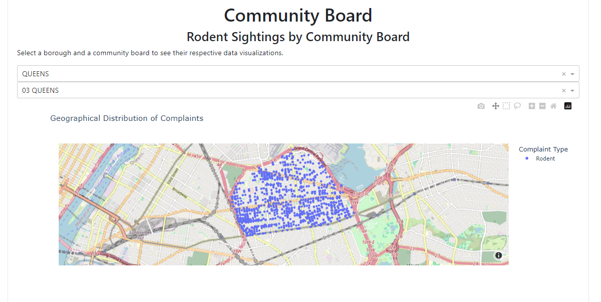

# Rats, Rodents, and NYC

## Final Writeup

**Eric Trautsch**

**BAIS:6140 Information Visualization**

**Fall 2023**

### Executive Summary

"Rats, Rodents, and NYC" is a comprehensive visualization project by Eric Trautsch, part of the BAIS:6140 Information Visualization course. It delves into the public health implications and historical data trends of New York City's rat population, utilizing datasets from NYC Open Data. The project aims to provide the public with practical insights into urban rodent populations, their impact on public health, and the effectiveness of city initiatives over time.

**Big Idea**

The central goal of this project is to empower NYC residents with actionable knowledge about the urban rodent problem that NYC faces. This project focuses on:

1. Historical Perspective

By analyzing historical data, the project provides insight into the changes in the rodent population over time. 

2. Notes about sightings data

Provides an analysis of the sightings data, focusing on when rats are sighted most often in the data

3. Public Health

Highlight the health risk associated with the rat population. Explore the relationship between rat sightings and health inspection results, emphasizing the food waste component of rodent population control in an urban environment.

4. Neighborhood Details

Provide insights for a particular neighborhood group (known as a community board in NYC). Allow consumers to interact and view details that pertain to their neighborhood and see changes over time.

5. Actionable Reccomendations

Provide details and practical steps that residents of NYC can perform to assist in urban rodent control efforts, through activism and lifestyle changes that can support changes to reduce the rodent population.

**Visualizations and Interactivity**

Using Dash, Plotly, and Tableau, this project presents interactive visualizations that facilitate user interaction with the data in an interesting way. The platform is avalible for consumtion on mobile or web applications and is meant to be accessible from a simple link or QR code.

### Basic Info

Project Title: Rats, Rodents, and NYC

Team Members: Eric Trautsch

### Data

For my dataset, I focused my search on NYC Open Data, finding an interesting dataset to propose an interesting question. (How bad is the NYC rat problem?)

The NYC Rat Sightings dataset can be found here (https://data.cityofnewyork.us/Social-Services/Rat-Sightings/3q43-55fe)

This dataset consists of rat sightings reported to the Department of Health and Mental Hygiene in NYC since 2010. This data is available frely to the public from the NYC Open Data website. 

Variables of particular interest include:
- Date reported (date)
- Address (categorical)
- Borough (categorical)
- Community Board (categorical)
- Latitude and Longitude (quantitative)

| Column Name                    | Description                                                                                                                                                                                   | Type        |
| ------------------------------ | --------------------------------------------------------------------------------------------------------------------------------------------------------------------------------------------- | ----------- |
| Unique Key                     | Unique identifier of a Service Request (SR) in the open data set                                                                                                                              | Plain Text  |
| Created Date                   | Date SR was created                                                                                                                                                                           | Date & Time |
| Closed Date                    | Date SR was closed by responding agency                                                                                                                                                       | Date & Time |
| Agency                         | Acronym of responding City Government Agency                                                                                                                                                  | Plain Text  |
| Agency Name                    | Full Agency name of responding City Government Agency                                                                                                                                         | Plain Text  |
| Complaint Type                 | This is the first level of a hierarchy identifying the topic of the incident or condition. Complaint Type may have a corresponding Descriptor (below) or may stand alone.                     | Plain Text  |
| Descriptor                     | This is associated to the Complaint Type, and provides further detail on the incident or condition. Descriptor values are dependent on the Complaint Type, and are not always required in SR. | Plain Text  |
| Location Type                  | Describes the type of location used in the address information                                                                                                                                | Plain Text  |
| Incident Zip                   | Incident location zip code, provided by geo validation.                                                                                                                                       | Plain Text  |
| Incident Address               | House number of incident address provided by submitter.                                                                                                                                       | Plain Text  |
| Street Name                    | Street name of incident address provided by the submitter                                                                                                                                     | Plain Text  |
| Cross Street 1                 | First Cross street based on the geo validated incident location                                                                                                                               | Plain Text  |
| Cross Street 2                 | Second Cross Street based on the geo validated incident location                                                                                                                              | Plain Text  |
| Intersection Street 1          | First intersecting street based on geo validated incident location                                                                                                                            | Plain Text  |
| Intersection Street 2          | Second intersecting street based on geo validated incident location                                                                                                                           | Plain Text  |
| Address Type                   | Type of incident location information available.                                                                                                                                              | Plain Text  |
| City                           | City of the incident location provided by geovalidation.                                                                                                                                      | Plain Text  |
| Landmark                       | If the incident location is identified as a Landmark the name of the landmark will display here                                                                                               | Plain Text  |
| Facility Type                  | If available, this field describes the type of city facility associated to the SR                                                                                                             | Plain Text  |
| Status                         | Status of SR submitted                                                                                                                                                                        | Plain Text  |
| Due Date                       | Date when responding agency is expected to update the SR. This is based on the Complaint Type and internal Service Level Agreements (SLAs).                                                   | Date & Time |
| Resolution Action Updated Date | Date when responding agency last updated the SR.                                                                                                                                              | Date & Time |
| Community Board                | Provided by geovalidation.                                                                                                                                                                    | Plain Text  |
| Borough                        | Provided by the submitter and confirmed by geovalidation.                                                                                                                                     | Plain Text  |
| X Coordinate (State Plane)     | Geo validated, X coordinate of the incident location.                                                                                                                                         | Number      |
| Y Coordinate (State Plane)     | Geo validated, Y coordinate of the incident location.                                                                                                                                         | Number      |
| Park Facility Name             | If the incident location is a Parks Dept facility, the Name of the facility will appear here                                                                                                  | Plain Text  |
| Park Borough                   | The borough of incident if it is a Parks Dept facility                                                                                                                                        | Plain Text  |
| Vehicle Type                   | If the incident is a taxi, this field describes the type of TLC vehicle.                                                                                                                      | Plain Text  |
| Taxi Company Borough           | If the incident is identified as a taxi, this field will display the borough of the taxi company.                                                                                             | Plain Text  |
| Taxi Pick Up Location          | If the incident is identified as a taxi, this field displays the taxi pick up location                                                                                                        | Plain Text  |
| Bridge Highway Name            | If the incident is identified as a Bridge/Highway, the name will be displayed here.                                                                                                           | Plain Text  |
| Bridge Highway Direction       | If the incident is identified as a Bridge/Highway, the direction where the issue took place would be displayed here.                                                                          | Plain Text  |
| Road Ramp                      | If the incident location was Bridge/Highway this column differentiates if the issue was on the Road or the Ramp.                                                                              | Plain Text  |
| Bridge Highway Segment         | Additional information on the section of the Bridge/Highway were the incident took place.                                                                                                     | Plain Text  |
| Latitude                       | Geo based Lat of the incident location                                                                                                                                                        | Number      |
| Longitude                      | Geo based Long of the incident location                                                                                                                                                       | Number      |
| Location                       | Combination of the geo based lat & long of the incident location                                                                                                                              | Location    |

I utilized the Restaurant Inspection Results dataset (found here)(https://data.cityofnewyork.us/Health/DOHMH-New-York-City-Restaurant-Inspection-Results/43nn-pn8j)
to augment the first dataset. This contains information about restaurants in NYC and the results of their health inspections. I focuesd on trying to find a correlation between critial resturant inspections and rat sightings. Trying to discover if particular parts of the city are more unclean and if areas with a high density of resturants might be more likely to have a higher rat population. This dataset is intended to support the rat sightings data.

| Column Name           | Description                                                                                                                                                                                                                                                                                                                                                                                                                                        | Type        |
| --------------------- | -------------------------------------------------------------------------------------------------------------------------------------------------------------------------------------------------------------------------------------------------------------------------------------------------------------------------------------------------------------------------------------------------------------------------------------------------- | ----------- |
| CAMIS                 | This is a unique identifier for the entity (restaurant); 10-digit integer, static per restaurant permit                                                                                                                                                                                                                                                                                                                                            | Plain Text  |
| DBA                   | This field represents the name (doing business as) of the entity (restaurant); Public business name, may change at the discretion of the restaurant owner                                                                                                                                                                                                                                                                                          | Plain Text  |
| BORO                  | Borough in which the entity (restaurant) is located; • 1 = MANHATTAN • 2 = BRONX • 3 = BROOKLYN • 4 = QUEENS • 5 = STATEN ISLAND • Missing; NOTE: There may be discrepancies between zip code and listed boro due to differences in an establishment's mailing address and physical location                                                                                                                                                       | Plain Text  |
| BUILDING              | Building number for establishment (restaurant) location                                                                                                                                                                                                                                                                                                                                                                                            | Plain Text  |
| STREET                | Street name for establishment (restaurant) location                                                                                                                                                                                                                                                                                                                                                                                                | Plain Text  |
| ZIPCODE               | Zip code of establishment (restaurant) location                                                                                                                                                                                                                                                                                                                                                                                                    | Plain Text  |
| PHONE                 | Phone Number; Phone number provided by the restaurant owner/manager                                                                                                                                                                                                                                                                                                                                                                                | Plain Text  |
| CUISINE DESCRIPTION   | This field describes the entity (restaurant) cuisine. Optional field provided by restaurant owner/manager                                                                                                                                                                                                                                                                                                                                          | Plain Text  |
| INSPECTION DATE       | This field represents the date of inspection; NOTE: Inspection dates of 1/1/1900 mean an establishment has not yet had an inspection                                                                                                                                                                                                                                                                                                               | Date & Time |
| ACTION                | This field represents the actions that are associated with each restaurant inspection; • Violations were cited in the following area(s). • No violations were recorded at the time of this inspection. • Establishment re-opened by DOHMH • Establishment re-closed by DOHMH • Establishment Closed by DOHMH. Violations were cited in the following area(s) and those requiring immediate action were addressed. • "Missing" = not yet inspected; | Plain Text  |
| VIOLATION CODE        | Violation code associated with an establishment (restaurant) inspection                                                                                                                                                                                                                                                                                                                                                                            | Plain Text  |
| VIOLATION DESCRIPTION | Violation description associated with an establishment (restaurant) inspection                                                                                                                                                                                                                                                                                                                                                                     | Plain Text  |
| CRITICAL FLAG         | Indicator of critical violation; "• Critical • Not Critical • Not Applicable"; Critical violations are those most likely to contribute to food-borne illness                                                                                                                                                                                                                                                                                       | Plain Text  |
| SCORE                 | Total score for a particular inspection; Scores are updated based on adjudication results                                                                                                                                                                                                                                                                                                                                                          | Number      |
| GRADE                 | Grade associated with the inspection; • N = Not Yet Graded • A = Grade A • B = Grade B • C = Grade C • Z = Grade Pending • P= Grade Pending issued on re-opening following an initial inspection that resulted in a closure                                                                                                                                                                                                                        | Plain Text  |
| GRADE DATE            | The date when the current grade was issued to the entity (restaurant)                                                                                                                                                                                                                                                                                                                                                                              | Date & Time |
| RECORD DATE           | The date when the extract was run to produce this data set                                                                                                                                                                                                                                                                                                                                                                                         | Date & Time |
| INSPECTION TYPE       | A combination of the inspection program and the type of inspection performed; See Data Dictionary for the full list of expected values                                                                                                                                                                                                                                                                                                             | Plain Text  |
| Latitude              | Number                                                                                                                                                                                                                                                                                                                                                                                                                                             | Number      |
| Longitude             | Number                                                                                                                                                                                                                                                                                                                                                                                                                                             | Number      |
| Community Board       | Plain Text                                                                                                                                                                                                                                                                                                                                                                                                                                         | Plain Text  |
| Council District      | Plain Text                                                                                                                                                                                                                                                                                                                                                                                                                                         | Plain Text  |
| Census Tract          | Plain Text                                                                                                                                                                                                                                                                                                                                                                                                                                         | Plain Text  |
| BIN                   | Plain Text                                                                                                                                                                                                                                                                                                                                                                                                                                         | Plain Text  |
| BBL                   | Plain Text                                                                                                                                                                                                                                                                                                                                                                                                                                         | Plain Text  |
| NTA                   | Plain Text                                                                                                                                                                                                                                                                                                                                                                                                                                         | Plain Text  |
| Location Point1       | Point                                                                                                                                                                                                                                                                                                                                                                                                                                              | Plain Text  |

The selected datasets were read in and cleaned using Python. For some charts, grouping was used, and for others filtering based the the needed specifications and required calculated fields.

When developing the interactive graph that allows for the selection of a particular community board, I discovered inconsistencies in the data relating to the Borough and Community Board relationship. I fixed this by ensuring that any community board MUST contain the name of the Borough to display, ensuring that these data collection errors are not shown.

Joins were completed using Tableau Relationships on the logical layer.

### Usage Scenario

A typical user, possibly an NYC resident, discovers the application through a QR code scanned in the subway. They are directed to the web address, where they can interact with the story.

The platform is optimized for both web and mobile, enabling quick interaction with detailed visualizations and calls to action.

### Visualizations

Note: Some of the figured (particularly the interactive ones) were created using plotly() and displayed as a part of my dash(https://dash.plotly.com/) application. This application is my final submission, and will be avalible hosted on Azure. Please view GitHub(https://github.com/ericTrautsch/bais6140project) to view source code including all documentation.

When creating the line chart, I noticed that many Boroughs tended to improve their data collection and no longer attribute sightings to Unspecified community boards. To not allow this change in process to affect the visualization too much, I limited the line charts on that to not go beyond 2018. Otherwise, the increase across the board may be attributed to something other than data collection practices. I noted this on that story point, since it may cause effects due to the apparant change in data collection processes.

### Reflection

Most enjoyable part was looking through the rat data and enjoying the weirdness of the dataset and problem objective. I liked using whatever software or storytelling technique to create a usable project. 

Least favorite was the documentation and figuring out the small details. I feel the project was over-documented (which is generally okay!), but I didn't enjoy writing about it that much.

From the project proposal, my goals have changed from _create a story in tableau to answer interesting questions about rat sightings_ to _how can I best share and explore rat sightings data and communicate that to an audiaence (more, data-journalism esque)_. 

My technical goals changed quite a bit. I included Plotly and Dash to create a sharable and extendible web-framework. This was a great chance to strech my technical skills and combine the theory that I've learned in this course with my personal development goals. 

My proposal was realistic to complete in Tableau. However, I've found great success and a more unified UI through my hosting strategy and plan to include a QR code linking to the website as part of my presentation.

I was able to implement most of my goals. I would have liked to dig deeper into advanced visualizations, but I was focusing more of a cohesive UI and structure, and didn't have time to include more advanced charts.

I was originally planning to include a Rodent Inspections data, comparing the rodent inspections with the sightings and providing more details about them. I didn't include this as I struggled to combine both of those datasets in a way that provided useful or interesting information. (not a lot of new information in the inspections).

If I was to create this project from scratch, I'd follow a similar path. I would likely try to collect more data about the rat problem, and conduct more studies into the actual effects of the population. I was able to include details about residents can do, but I would like to provide an even better overview of the systemic problem as a whole.

A semi-major refactor was needed to migrate to source controlled work and use the Dash interface. Some charts created in Tableau were re-created with plotly, and others were not and linked via image. In the future, I'd create the story components, and then create the visualization to use.

### Project Management and Team Assessment

| **Task**                | **Completed** | **Estimated Hours** | **Actual Hours** |
| ----------------------- | ------------- | ------------------- | ---------------- |
| Project Proposal        | 11/02/2023    | 6                   | 5                |
| EDA                     | 11/09/2023    | 1                   | 3                |
| Iteration 1 complete    | 11/12/2023    | 8                   | 5                |
| Iteration 2 complete    | 11/28/2023    | 7                   | 7.5              |
| Final Presentation      | 12/5/2023     | 5                   | 3                |
| Final Recording         | 12/3/2023     | 2                   | 1                |
| Final writeup completed | 12/3/2023     | 10                  | 12               |

All work was completed by Eric (only member of the project team). No complaints here. 

### Credits

- NYC OpenData
- Course Notes
- The Dash and Plotly projects
  - Built heavily upon the dash framework to host and manage application
- Tableau
- Microsoft Azure for deployment
- GitHub Source Control