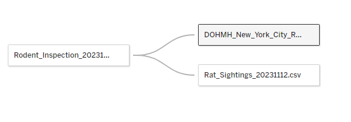
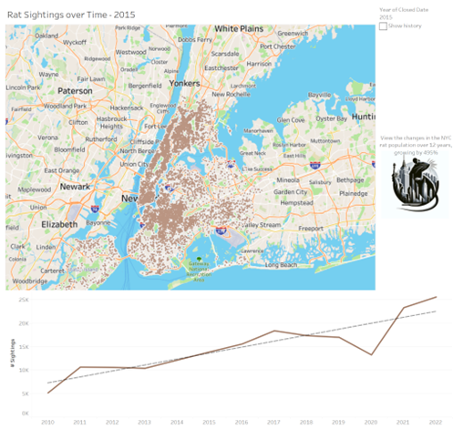
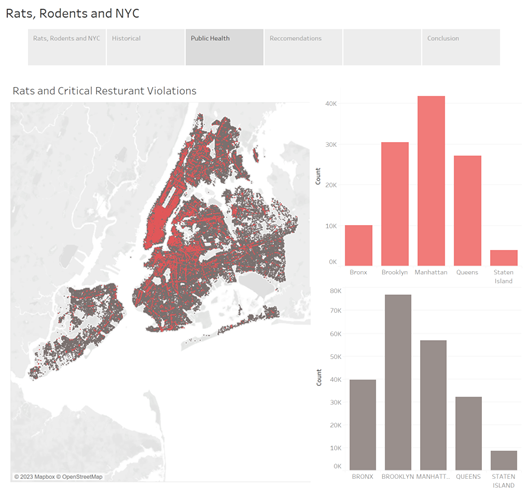

Rats, Rodents, and New York City

Project Update 2

Eric Trautsch

BAIS:6140 Information Visualization

Fall 2023

**Introduction**

This visualization seeks to show the average New York City (NYC) resident the 'whole' story of the rat problem the city faces. Showing the growth of the rat population over the years and focusing on educating on the areas of New York City where the issue is common. The rat population poses health risks and shows issues with sanitization and a safe living environment.

To do this, it plans to focus on the interconnection of rat sightings, rodent inspections, and restaurant health inspection results. By learning from this data, the project seeks to provide practical insights and explore the historical trend and current impact of rat populations. 

**Implementation**

I began my visualization development by following my storyboard to build a guideline of my strategy. This is after some basic EDA to get trends in the data. The spirit of the drawings from the project proposal have been implemented, but one of the drawings (interactive graph) hasn't been implemented yet due to a technical error that is being worked through.

Designing the interface from the usage scenario makes me focus on the overall story. The goal of the visualization is to provide New Yorkers with the details quickly and simply. My focus was on creating the overall story scaffolding, so I can improve the visualizations as the project continues to develop.

See Visualizations here: [https://public.tableau.com/app/profile/eric.trautsch/viz/RatsRodentsAndNewYorkCity/RatsRodentsandNYC?publish=yes](https://public.tableau.com/app/profile/eric.trautsch/viz/RatsRodentsAndNewYorkCity/RatsRodentsandNYC?publish=yes)

**Project Writeup:**

**Data**

Limited data preprocessing has been needed at this point. Relationships between the datasets have been made. There are some inconsistencies between the datasets, but those are resolved with calculated fields to change spelling/capitalization of strings. 

Note: I have not included Data Dictionaries and the three included datasets in the Project Proposal. Please refer to it for information about the Data.

**Big Idea + Storyboard**

For this project update, I will highlight the parts of my initial storyboard that I have completed in Yellow. There have been minor changes to the story, focusing on the impacts of historical data and with some learnings about the public health data. Story is very similar to previous and focused on showing the public health and historical changes in the rat population in NYC.

Big Idea

This project seeks to empower the NYC public with practical insights around urban rodent populations, including its effects on public health and how this has changed historically in the NYC area.

Idea: Introduce public audience to concern of growing urban rat population in NYC, highlight impacts on public health (restaurant inspections) and general environment.

- Display current distribution of rat population/sightings, finding hotspots and areas of focus for inspection
- Provide any maps to correlate rodent populations to environmental factors

_Public health_

- Public health risks associated with rat population, transmission of disease, etc
- Show relationship between rat sighting and health inspection results, highlight food safety

_Historical_

- View historical view of rodent population, compare to current
- Possibly show city initiatives and how they were successful/not successful

_Recommendations_

- Any call to action for NYC public; reporting rodent population and promoting a safer NYC

**Visualization**

Viz about current rat populations/sightings, including focus on historical population. Included NYC Map. For now, my interactive dashboard is showing the changes in the rat population over time. This will be improved for the next project update, this was not my focus for the start of the project.

Using point marks and color channels, for the most part.

Views are linked together in a single Tableau Story. See the current iteration here. [https://public.tableau.com/app/profile/eric.trautsch/viz/RatsRodentsAndNewYorkCity/RatsRodentsandNYC?publish=yes](https://public.tableau.com/app/profile/eric.trautsch/viz/RatsRodentsAndNewYorkCity/RatsRodentsandNYC?publish=yes)

For the second view, we have rat sightings overlayed on critical restaurant inspections. This was to try to discover a correlation between rat sightings and critical restaurant inspections. This chart uses points and colors as channels. The colors map to the bar charts on the side, which use length as a channel and (effectively) continue the color channel from the map.

The design that I've used up to this point is focused on creating a format that can be viewed on somewhere like a subway. Being able to show new Yorkers this data in a more passive way can help promote general awareness, and a link to the usage could be included. This usage structure requires that some visualizations are able to be printed or displayed on a monitor (eg: the historical growth over time), and linked to the full interactive components of the visualization.

Viz attend to address:

- Current state
- Public health concerns
- Historical trends
- Recommendations and suggestions based on previous

**Usage Scenario**

**Reflection**

For the first project milestone, the project has not changed very much. Based on the data collected, trends are as shown in the EDA component.

The visualization goals are growing due to my desire to show the information more interactively. To combine the three datasets, I've selected in a meaningful, simple enough, but enlightening way.

The combination of three massive datasets has proven to be more difficult to extract meaning of than expected. I continue to learn more about designing multi-layer maps and how to better integrate the datasets together.

**Project Management and Team Assessment**

| **Task** | **Completed** | **Estimated Hours** | **Actual Hours** |
| --- | --- | --- | --- |
| Project Proposal |
 | 6 | 5 |
| EDA | 11/09/2023 | 1 | 3 |
| Iteration 1 complete | 11/12/2023 | 8 | 5 |
| Iteration 2 complete |
 | |
 |
| Final writeup completed |
 |
 |
 |
| Project Presentation |
 |
 |
 |

All work was completed by Eric (only member of the project team).

**Credits**

- NYC OpenData
- Course Notes
- DALL-E AI Model for generating the logo.