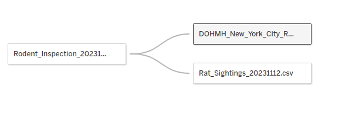
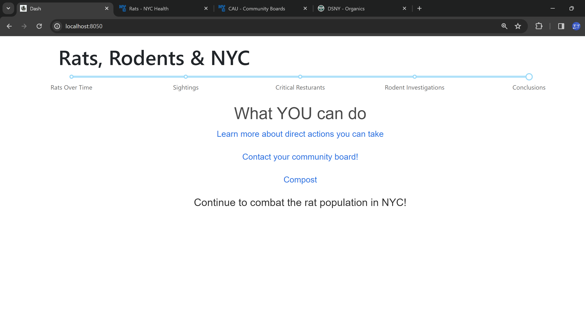

# Rats, Rodents, and New York City

## Project Update 2

**Eric Trautsch**

**BAIS:6140 Information Visualization**

**Fall 2023**

### Introduction

This visualization aims to present the average New York City (NYC) resident with a comprehensive view of the city's ongoing rat problem. It highlights the growth of the rat population over time and focuses on educating about the areas in NYC where this issue is most prevalent. The burgeoning rat population not only poses significant health risks but also relates to broader issues related to sanitation and safe living conditions.

This project combines data from rat sightings, rodent inspections, and restaurant health inspections to provide actionable insights and illuminate the historical and current impact of rat populations in NYC. This tool is designed for both current and prospective NYC residents, offering a clear understanding of the problem's scope and advocating for enhanced citywide rodent management strategies.

### Implementation

Following initial Exploratory Data Analysis (EDA) to identify trends, the development of this visualization adhered to a storyboard-driven tactical path. In pursuit of an optimal User Experience (UX) for a large city's populace, emphasis was placed on creating a modular, web-friendly interface.

The design process was guided by usage scenarios, prioritizing the conveyance of detailed information quickly and succinctly, potentially through a QR code scanned in the subway. The project's current focus is on refining the visualizations' narrative and structural elements.

View the Visualizations that will be used here: [Rats, Rodents, and New York City Visualization](https://public.tableau.com/app/profile/eric.trautsch/viz/RatsRodentsAndNewYorkCity/RatsRodentsandNYC?publish=yes)

View source of Dash application here. [Dash appliation source](https://github.com/ericTrautsch/bais6140project)

### Project Writeup:

#### Data

So far, data preprocessing has been minimal, focusing on establishing relationships between datasets. Inconsistencies, primarily in string formats, have been addressed using calculated fields for standardization.

Note: Data Dictionaries and detailed dataset descriptions from the Project Proposal are not included here. Please refer to the initial proposal for comprehensive data information. The project's main themes remain consistent, with an added emphasis on public engagement, reflecting a 'grassroots/underground' style of information dissemination.

#### Big Idea + Storyboard

The narrative remains largely unchanged, focusing on the public health implications and historical data trends concerning NYC's rat population.

**Big Idea**

The project's central goal is to empower NYC's public with practical insights about urban rodent populations, their impact on public health, and historical changes in the area.

- **Public health**: Highlight the health risks associated with the rat population, including disease transmission. Explore the relationship between rat sightings and health inspection results, emphasizing food safety.
- **Historical**: Provide a historical perspective on rodent population changes, evaluating city initiatives' effectiveness.
- **Recommendations**: Suggest actionable steps for the NYC public; promoting reporting mechanisms and advocating for a safer city.

### Visualization

The current visualizations display rat populations and sightings, with a focus on historical trends. The NYC Map is an interactive dashboard illustrating these changes over time.

Using point marks and color channels, the visualizations are designed to be informative and engaging.

The views are integrated into a single Dash dashboard. [View source here](https://github.com/ericTrautsch/bais6140project)

A secondary view overlays rat sightings with critical restaurant inspections to explore potential correlations. This visualization uses points and color channels, with bar charts on the side continuing the color narrative.

The design is tailored for passive consumption, such as in subway displays, promoting broader public awareness.

The visualizations address:

- Current state and public health concerns.
- Historical trends.
- Recommendations based on data analysis.

These views integrated into the dash view, will allows for more customization of the UX while viewing the dashboard. At this time, visualzations are selected using this slider:

This can be updated and adjusted to best fit the UX, although the slider has already seen an improved in a minimalist UX, which was the goal of this shift. Future work includes integrating Tableau visualizations, and updating interactivity in the Dash application to provide even better UX. Finally, creating another visualization that combines all three datasets with maximum interactivity; focusing on allowing consumers of this application to have maximum control and discover their own insights about their neighborhood.

### Usage Scenario

A typical user, possibly an NYC resident, discovers the application through a QR code scanned in the subway. They are directed to the web address, where they can interact with the story.

The platform is optimized for both web and mobile, enabling quick interaction with detailed visualizations and calls to action.

### Reflection

The project remains aligned with the initial proposal, maintaining a focus on historical data, public health, and critical restaurant violations. The primary evolution lies in enhancing the delivery mechanism of the visualizations, making them more interactive and accessible. Technical advancements have included adopting new tools like Dash and Plotly, inspired by [The Pudding](https://pudding.cool/). This shift aims to emulate styles seen in modern data journalism.

### Project Management and Team Assessment

| **Task**                | **Completed** | **Estimated Hours** | **Actual Hours** |
| ----------------------- | ------------- | ------------------- | ---------------- |
| Project Proposal        | 11/02/2023    | 6                   | 5                |
| EDA                     | 11/09/2023    | 1                   | 3                |
| Iteration 1 complete    | 11/12/2023    | 8                   | 5                |
| Iteration 2 complete    | 11/28/2023    | 7                   | 7.5              |
| Final Presentation      |               | 5                   |                  |
| Final Recording         |               | 2                   |                  |
| Final writeup completed |               | 6                   |                  |

All work was completed by Eric (only member of the project team).

### Credits

- NYC OpenData
- Course Notes