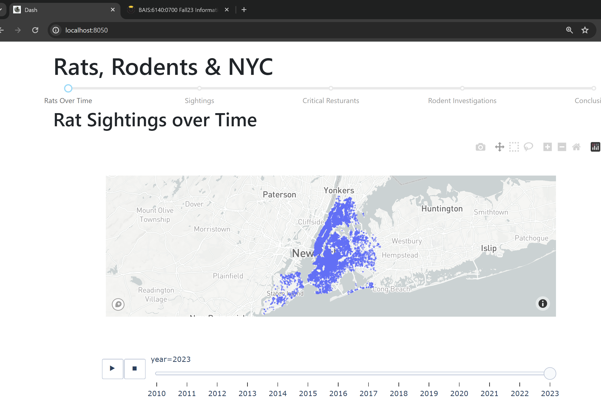

Rats, Rodents, and New York City

Project Update 2

Eric Trautsch

BAIS:6140 Information Visualization

Fall 2023

**Introduction**

This visualization seeks to show the average New York City (NYC) resident a view of the rat problem the city faces. Showing the growth of the rat population over the years and focusing on educating on the areas of New York City where the issue is common. The rat population poses health risks and illuminates issues with sanitization and a safe living environment.

To do this, this project focuses on the interconnection of rat sightings, rodent inspections, and restaurant health inspection results. By learning from these datasets, the project seeks to provide practical insights and explore the historical trend and current impact of rat populations. 

This project would ideally be consumed by any New York City resident, or future resident, to be aware of the scope of the problem and to advocate for better and more improved methods to manage this problem by the city of New York City.

**Implementation**

The visualization development began by following a storyboard to build a tactical path to completion. This is after some basic EDA to get trends in the data. In order to provide better UX (user experience) for citizens of a large city, I wanted to create a more modular and web-friendly interface.

Designing the interface from the usage scenario makes me focus on the overall story. The goal of the visualization is to provide New Yorkers with the details quickly and simply, possibly by scanning a QR code on the subway. My focus was on creating the overall story scaffolding, and will continue improve to improve the visualizations as the project continues to develop.

See Visualizations here: [https://public.tableau.com/app/profile/eric.trautsch/viz/RatsRodentsAndNewYorkCity/RatsRodentsandNYC?publish=yes](https://public.tableau.com/app/profile/eric.trautsch/viz/RatsRodentsAndNewYorkCity/RatsRodentsandNYC?publish=yes)

**Project Writeup:**

**Data**

Limited data preprocessing has been needed at this point. Relationships between the datasets have been made. There are some inconsistencies between the datasets, but those are resolved with calculated fields to change spelling/capitalization of strings. 

Note: I have not included Data Dictionaries and the three included datasets selected in the Project Proposal. Please refer to it for information about the Data.
 The main points remain the same, but the focus on a call to action to the public has been included to match the format of a 'grassroots/underground' style information sharing.
**Big Idea + Storyboard**

For this project update, I will highlight the parts of my initial storyboard that I have completed in Yellow. There have been minor changes to the story, focusing on the impacts of historical data and with some learnings about the public health data. Story is very similar to previous and focused on showing the public health and historical changes in the rat population in NYC.

Big Idea

This project seeks to empower the NYC public with practical insights around urban rodent populations, including its effects on public health and how this has changed historically in the NYC area.

Idea: Introduce public audience to concern of growing urban rat population in NYC, highlight impacts on public health (restaurant inspections) and general environment.

- Display current distribution of rat population/sightings, finding hotspots and areas of focus for inspection
- Provide any maps to correlate rodent populations to environmental factors

_Public health_

- Public health risks associated with rat population, transmission of disease, etc
- Show relationship between rat sighting and health inspection results, highlight food safety

_Historical_

- View historical view of rodent population, compare to current
- Possibly show city initiatives and how they were successful/not successful

_Recommendations_
 The main points remain the same, but the focus on a call to action to the public has been included to match the format of a 'grassroots/underground' style information sharing.
- Any call to action for NYC public; reporting rodent population and promoting a safer NYC

**Visualization**

Viz about current rat populations/sightings, including focus on historical population. Included NYC Map. For now, my interactive dashboard is showing the changes in the rat population over time, meeting the historical requirements of showing the growth over time.

Using point marks and color channels, for the most part.

Views are linked together in a single Tableau Story. See the current iteration here. [https://public.tableau.com/app/profile/eric.trautsch/viz/RatsRodentsAndNewYorkCity/RatsRodentsandNYC?publish=yes](https://public.tableau.com/app/profile/eric.trautsch/viz/RatsRodentsAndNewYorkCity/RatsRodentsandNYC?publish=yes)

For this second view, we have rat sightings overlayed on critical restaurant inspections. This was to try to discover a correlation between rat sightings and critical restaurant inspections. This chart uses points and colors as channels. The colors map to the bar charts on the side, which use length as a channel and (effectively) continue the color channel from the map.

The design that I've used up to this point is focused on creating a format that can be viewed on somewhere like a subway. Being able to show new Yorkers this data in a more passive way can help promote general awareness, and a link to the usage could be included. This usage structure requires that some visualizations are able to be printed or displayed on a monitor (eg: the historical growth over time), and linked to the full interactive components of the visualization.

Viz attend to address:

- Current state
- Public health concerns
- Historical trends
- Recommendations and suggestions based on previous

**Usage Scenario**

A user is interested in viewing the application. In particular, this NYC resident may have scanned a flyer with a QR code on the subway. They are brought to this web address, and can interact with this story.

This view is web and mobile native, and will allow a user to quickly interact with visualizations and see more details and calls to action.

**Reflection**

From the initial proposal, the project is quite similar. I still plan to focus on the historical, public health, and critical resturant violations. However, I plan to focus on delivering the visualizations in an effective way. The main points remain the same, but the focus on a call to action to the public has been included to match the format of a 'grassroots/underground' style information sharing.

For this iteration 2, I have focused on refining the delivery, so the visualization goals are similar. However, the focus on interactivity has increased, since my goal of improving deliveribility has increased. My visualization goals are simple and plan to focus on explaining the data and finding ways to call to action.

Technical goals have increased quite drastically. I have began using new tools (Dash)[https://dash.plotly.com/] and thereby [plotly](https://plotly.com/). This is heavily inspired by the (pudding)[https://pudding.cool/] and my goal with this visualization was to begin to mimic the technical style of these visualizations, focusing on a high performing deliveriblity. As far as plotting goes, the technical difficulty of plotly charts are similar to Tableau, just a different format to create. I plan to use a combination, and have migrated some charts from Tableau to this other interactive format.

**Project Management and Team Assessment**

| **Task**                | **Completed** | **Estimated Hours** | **Actual Hours** |
| ----------------------- | ------------- | ------------------- | ---------------- |
| Project Proposal        | 11/02/2023    | 6                   | 5                |
| EDA                     | 11/09/2023    | 1                   | 3                |
| Iteration 1 complete    | 11/12/2023    | 8                   | 5                |
| Iteration 2 complete    | 11/28/2023    | 7                   | 7.5              |
| Final Presentation      |               | 5                   |                  |
| Final Recording         |               | 2                   |                  |
| Final writeup completed |               | 6                   |                  |

All work was completed by Eric (only member of the project team).

**Credits**

- NYC OpenData
- Course Notes
- DALL-E AI Model for generating the logo.

